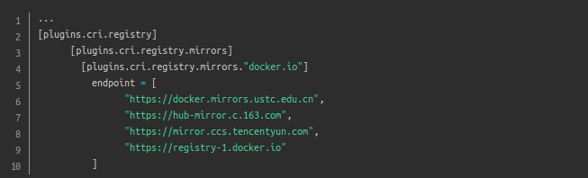
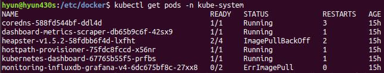
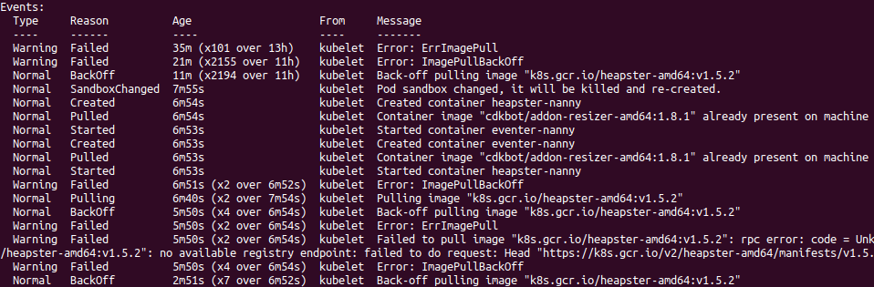
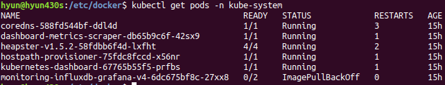
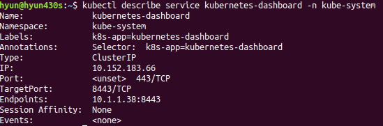
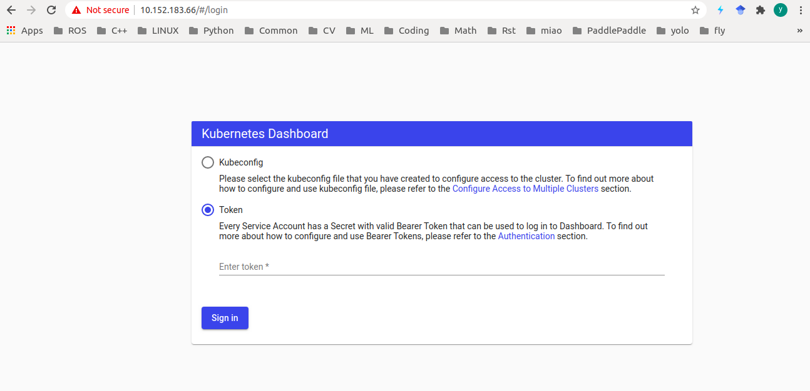
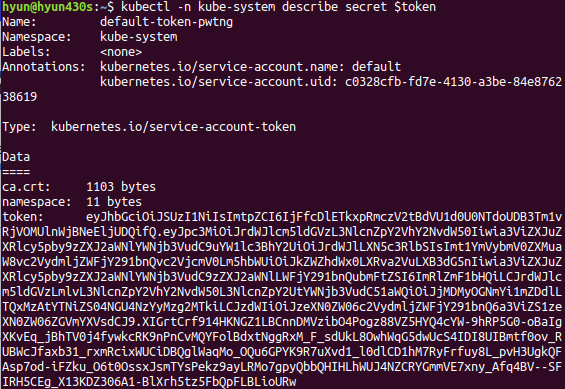
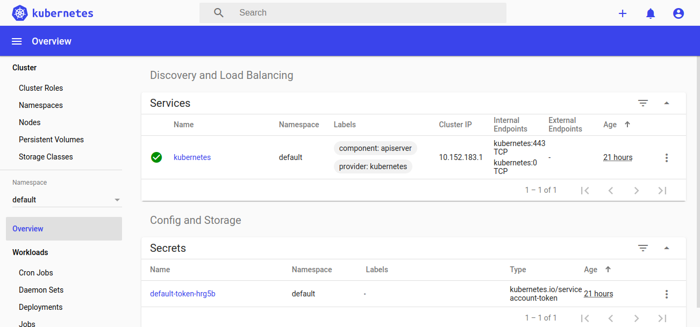

Installing Kubeflow
====================

本文使用MicroK8s在Linux上安装Kubeflow

Install MicroK8s
-----------------

Microk8s 需要在安装了Docker的前提下使用

| ``sodu apt-get install docker.io``

1. Install MicroK8s on Linux

``sudo snap install microk8s --classic --channel=1.18/stable``

.. note::

    | 确保主机名称不包含下划线，通过如下命令修改主机名
    | ``sudo vi /etc/hostname``
    | ``sudo vi /etc/hosts``
    | ``reboot``

2. 添加路径

| ``echo "export PATH=$PATH:/snap/bin" >> ~/.bashrc``
| ``source ~/.bashrc``

3. 添加用户组

| ``sudo usermod -a -G microk8s $USER``
| ``sudo chown -f -R $USER ~/.kube``
| ``su - $USER``

4. Check the status

| ``microk8s status --wait-ready``

配置microk8s内置docker的registry.mirrors

编辑 /var/snap/microk8s/current/args/containerd-template.toml 文件，加入以下内容

5. 启动相关的add-on

| ``microk8s enable dashboard dns registry istio``

可通过
``microk8s enable --help`` 命令查看可打开的服务

6. 查看版本信息

| ``sudo snap alias microk8s.kubectl kubectl``
| ``kubectl version``

7. 查看pods

| ``kubectl get pods -n kube-system``
| 或使用如下命令查看pods和services的运行情况
| ``kubectl get all --all-namespaces``

正常情况下都处于running状态，否则需要根据NAME查看pods具体情况

| ``kubectl describe pods heapster-v1.5.2-58fdbb6f4d-lxfht -n kube-system``

可看到拉取镜像
``k8s.gcr.io/heapster-amd64:v1.5.2`` 拉取失败

**手动拉取镜像**

| 下载docker hub上的镜像
| ``sudo docker pull registry.aliyuncs.com/google_containers/heapster-amd64:v1.5.2``
| 修改镜像tag
| ``sudo docker tag registry.aliyuncs.com/google_containers/heapster-amd64:v1.5.2 k8s.gcr.io/heapster-amd64:v1.5.2``
| 保存镜像为tar文件
| ``sudo docker save k8s.gcr.io/heapster-amd64:v1.5.2 > pause.tar``
| 将tar文件上传到microk8s的docker中
| ``microk8s.ctr image import pause.tar``
| 查看镜像
| ``microk8s ctr image ls``

查看pod是否运行成功

8. 访问dashboard

| ``microk8s dashboard-proxy``
| 浏览器打开 https://127.0,0.1:10443, 输入token验证即可

或者:

a. 获取访问ip和端口

``kubectl describe service kubernetes-dashboard -n kube-system``

b. 浏览器输入ip地址

c. 获取token

::

    token=$(microk8s kubectl -n kube-system get secret | grep default-token | cut -d " " -f1)
    echo $token
    kubectl -n kube-system describe secret $token

d. 输入token后就进入管理页面了

**解决google打不开dashboard**

::

    mkdir key && cd key
    #生成证书
    openssl genrsa -out dashboard.key 2048
    #master ip 192.168.31.105
    openssl req -new -out dashboard.csr -key dashboard.key -subj '/CN=192.168.31.105'
    openssl x509 -req -in dashboard.csr -signkey dashboard.key -out dashboard.crt
    #删除原有的证书secret
    kubectl delete secret kubernetes-dashboard-certs -n kube-system
    #创建新的证书secret
    kubectl create secret generic kubernetes-dashboard-certs --from-file=dashboard.key --from-file=dashboard.crt -n kube-system
    #查看pod
    kubectl get pod -n kube-system
    #删除pod
    kubectl delete pod <pod name> -n kube-system
    #重启
    kubectl.stop
    kubectl.start

Install Kubeflow
-----------------

kubeflow 至少要求2CPUs，16Gb RAM，50Gb free disk。

1. install microk8s

2. ``microk8s.enable kubeflow``

安装失败原因总结：

* 版本原因，microk8s 从1.17才开始支持kubeflow

* juju报错，Couldn't contact api.jujucharms.com

* Service snap.microk8s.daemon-apiserver is not running

* 资源不够

*安装参考文档*

| https://jaas.ai/kubeflow
| https://ubuntu.com/kubeflow/install#5-install-kubeflow-using-kfctl
| https://charmed-kubeflow.io/docs/install

常用命令
--------

**停止服务**

``microk8s.stop``

**启动服务**

``microk8s.start``

**卸载microk8s**

``sudo snap remove microk8s``

**查看node**

``kubectl get nodes``

**查看services**

``kubectl get services``

**查看当前安装的版本**

``snap list``

参考文档
---------

| `Installing Kubeflow <https://www.kubeflow.org/docs/started/getting-started/>`_
| `microk8s 安装istio <https://www.jianshu.com/p/6c5c69fce0f4>`_
| `通过MicroK8s搭建K8s环境 <https://soulteary.com/2019/09/08/build-your-k8s-environment-with-microk8s.html>`_
| `使用snap安装microk8s <https://www.codenong.com/cs105906909/>`_
