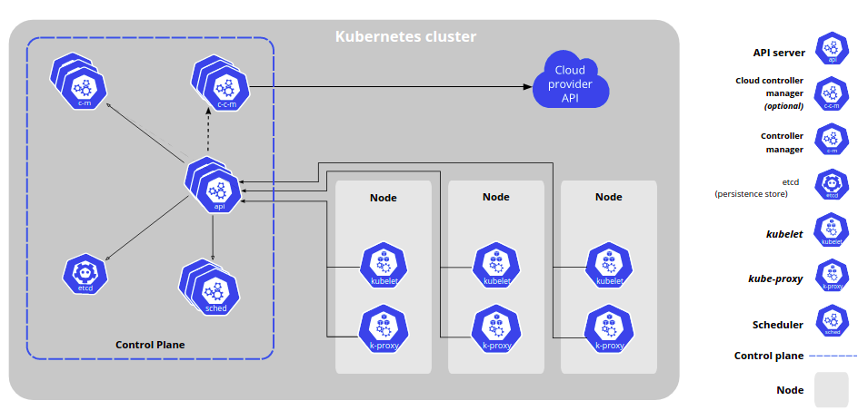
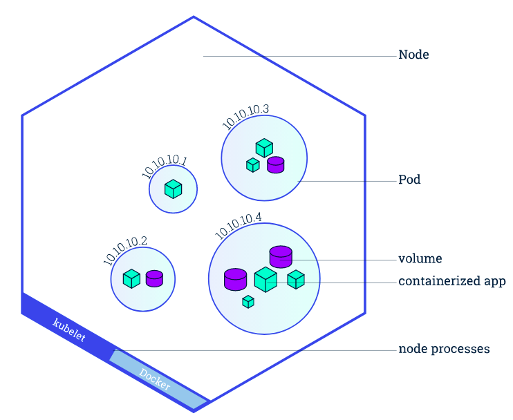
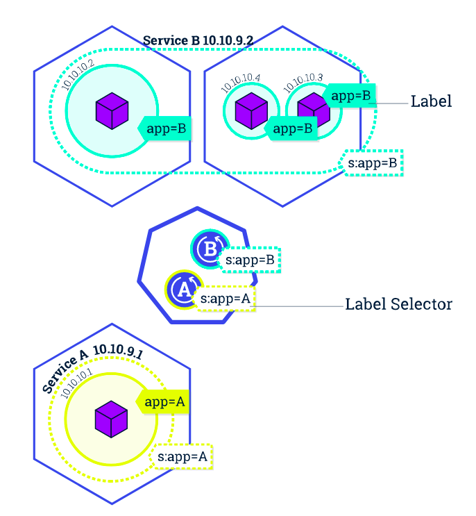

Introduction
=============

Kubernetes是用于自动部署，管理和扩展容器化应用程序的开源系统。

Kubernetes 提供：

* 服务发现和负载均衡
* 存储编排
* 自动部署和回滚
* 自动完成装箱计算
* 自我修复
* 密钥于管理配置

Kubernetes 组件
----------------

**控制平面组件**

对集群作出全局决策，检测及相应集群事件

*kube-apiserver*

该组件公开了Kubernetes API。API服务器时Kubernetes控制面的前端

*etcd*

集群数据的后台数据库

*kube-schedule*

监视新创建的未指定运行节点的Pod，并选择节点让Pod在上面运行

*kube-controller-mannager*

在主节点上运行控制器的组件

*cloud-controller-mannager*

嵌入特定云的控制逻辑的控制平面组件

**Node组件**

节点组件在每个节点上运行，维护运行的Pod并提供Kubernetes运行环境

*kubelet*

一个在集群中每个节点上运行的代理，保证容器都运行在Pod中

*kube-proxy*

集群中每个节点上运行的网络代理，实现Kubernetes service 概念的一部分

*容器运行时*

负责运行容器的软件

**插件**

插件适用Kubernetes资源(DaemonSet, Deployment)实现集群功能

*DNS*

*Web界面*

*容器资源监控*

Kubernetes 基础
----------------

**1.创建集群**

Master 负责管理整个集群，Node是一个虚拟机或物理机

``minikube start``

kubectl是Kubernetes的命令行工具

| ``kubectl cluster-info`` 查看集群信息
| ``kubectl get nodes`` 显示所有节点

**2.部署应用**

Delpoyment 指挥Kubernetes 如何创建和更新应用程序的实例

``kubectl create deployment kubernetes-bootcamp --image=gcr.io/google-samples/kubernetes-bootcamp:v1``

``kubectl get deployments`` 显示 deployments

**3.了解应用**

*工作节点和Pod*

在创建Delpoyment时，Kubernetes添加了一个Pod来托管引用程序。Pod是抽象出来的表示
一组一个或多个应用程序容器及以这些容器的一些共享资源。

Pod是Kubernetes平台上的原子单元，每个Pod都与调度他的节点绑定，一个节点可以有多个Pod

| ``kubectl get pods``
| ``kubectl describe pods``

**4.公开暴露应用**

Kubernetes 中的Service是一种抽象概念，定义了Pod的逻辑辑和访问Pod的协议。
Service 下的一组Pod通常由LabelSelector来标记，Service 将Pod暴露在集群外部以供访问。

``kubectl get sevices`` 获取服务列表

| 创建一个新的服务并暴露
| ``kubectl expose deployment/kubernetes-bootcamp --type="NodePort" --port 8080``

| 获取服务详细信息
| ``kubectl describe services/kubernetes-bootcamp``

| 通过label来获取信息
| ``kubectl get services -l run=kubernetes-bootcamp``

| 删除服务
| ``kubectl delete services -l run=kubernetes-bootcamp``

参考文档
---------

| `Kubernetes 组件 <https://kubernetes.io/zh/docs/concepts/overview/components/>`_
