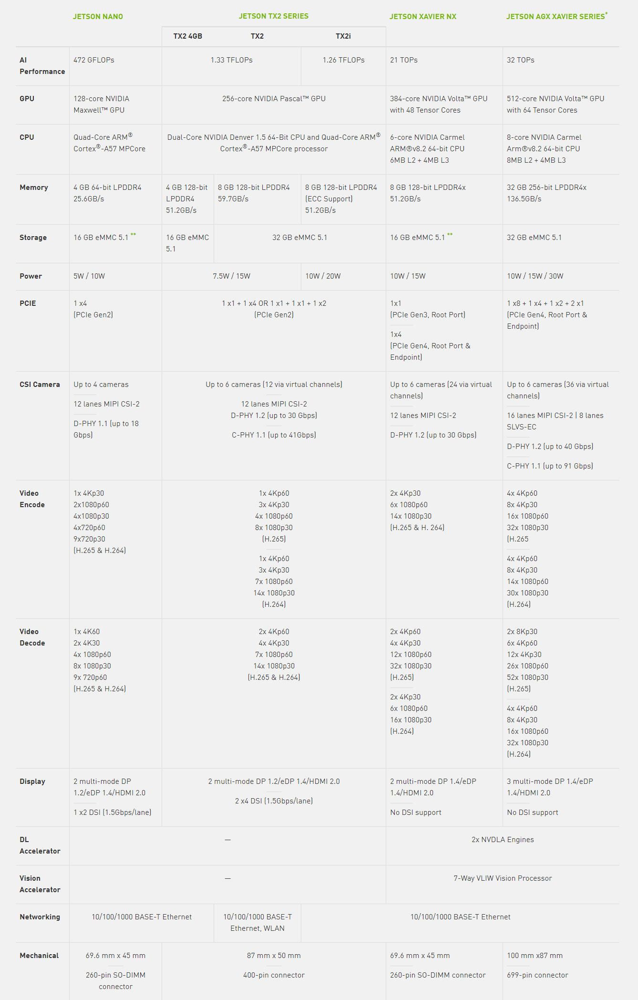
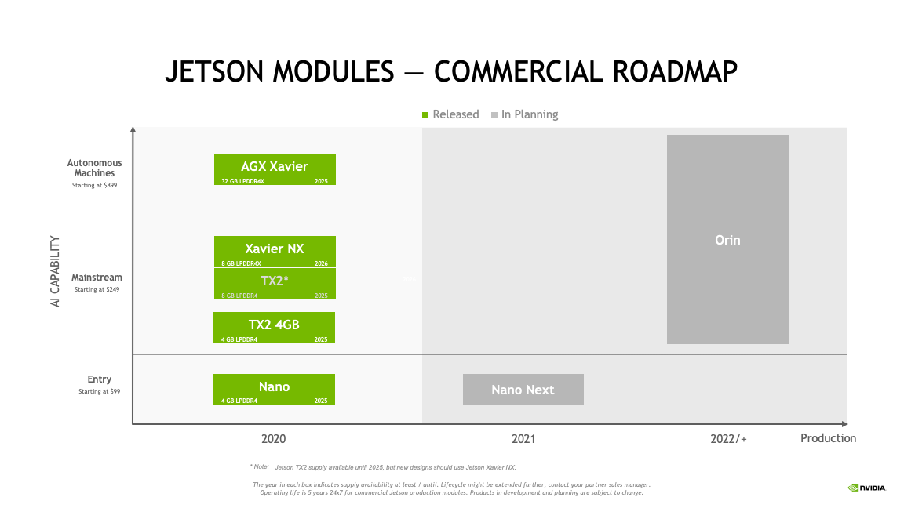
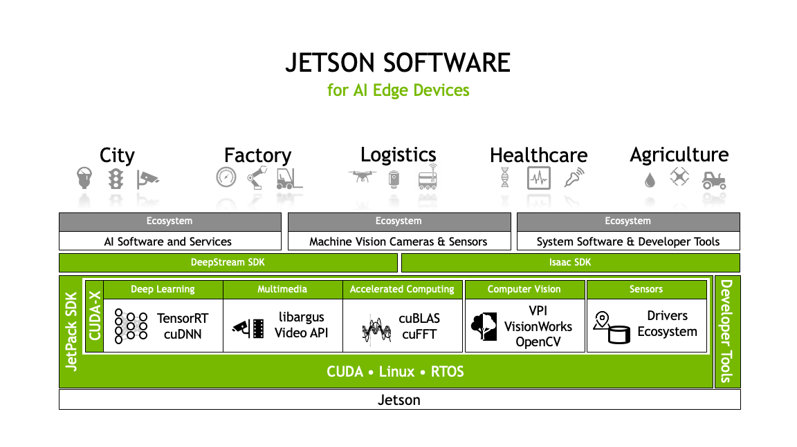
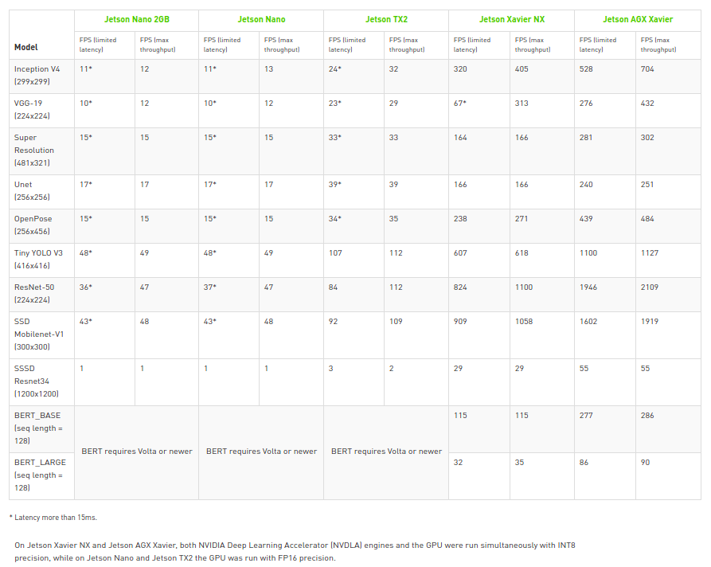

Nvidia Jetson
==============

What is Jetson?
---------------

Nvidia Jetson 是先进的AI边缘设备平台，面向移动嵌入式系统市场中的GPU加速并行处理。
在深度学习和计算机视觉方面高性能，低能耗计算，使得Jetson成为计算密集型嵌入式项目的理想平台。

Jetson 系列对比
--------------------

目前Jetson产品线有四个系列的产品(TK1和TX1已经停产)，包括Jetson Nano, Jetson TX2,
Xavier NX, AGX Xavier。

四个产品的定位是不同的。Jetson Nano比较适合和体量较小的设备，定位入门级，售价99美元；
Jetson TX2比Jetson Nano支持的摄像头数量更多，而且有专门的安全核心，售价249美元起；
Xavier NX的尺寸最小，但性能却是Jetson Nano的50倍，并且Xavier NX可以与Jetson Nano的主板兼容，价格399美元；
AGX Xavier是一个全功能平台，用户可通过AGX Xavier打造机器人，比如送货机器人，AGX Xavier可以实现自主驾驶。

Hardware Roadmap
-----------------

Jetson Software
----------------

Nvidia Jetson 设备都由同一个Nvidia软件堆栈支持，使得一次开发可以部署到任意设备。
JetPack SDK 是开发AI应用程序最完善的解决方案。它含最新的基于linux操作系统的驱动包(L4T)，CUDA-X加速库以及用于AI边缘
应用开发的APIs。同时包括用于主机和开发套件的示例和文档及开发工具，并支持更高级别
的SDK，如用于流视频分析的DeepStream和用于机器人的Isaac。

Key Features in JetPack
~~~~~~~~~~~~~~~~~~~~~~~~

**OS**

Nvidia L4T provides the bootloader, Linux kernel, necessary firmwares, NVIDIA drivers, sample filesystem, and more.

**TensorRT**

Nvidia TensorRT 是建立在CUDA之上，用于高性能深度学习推理的SDK。此SDK 包含深度学习推理优化器和运行时环境，可为深度学习推理应用提供低延迟和高吞吐量。

**cuDNN**

NVIDIA cuDNN是用于深度神经网络的GPU加速库。它强调性能、易用性和低内存开销。NVIDIA cuDNN可以集成到更高级别的机器学习框架中，如加州大学伯克利分校的流行CAFFE软件。简单的，插入式设计可以让开发人员专注于设计和实现神经网络模型，而不是调整性能，同时还可以在GPU上实现高性能现代并行计算。

**CUDA**

CUDA是一种由Nvidia推出的通用并行计算架构，为C和C++开发人员构建GPU加速的应用程序提供了全面的开发环境。该工具包包括用于NVIDIA GPU的编译器，数学库以及用于调试和优化应用程序性能的工具。

**Multimedia API**

提供的级别的API用于灵活的应用开发，如Camera application API，Sensor driver API。

**Computer Vision**

包括用于CV和图像处理的软件开发包VisionWorks，Opencv，VPI(Version Programing Interface)。

**Developer Tools**

The toolkit includes Nsight Eclipse Edition, debugging and profiling tools including Nsight Compute, and a toolchain for cross-compiling applications。

Jetson Benchmarks
------------------

应用场景
---------

| * 机器人
| 让机器人和其他自主机器感知，导航和操纵周围的世界
|
| * 机器视觉
| 使用AI通过自主光学检测(AOI)技术快速精确定位缺陷部位，确保产品最高品质

| * AIoT
| AI为多种物联网网关和边缘设备带来强大功能，实现传感器和数据的区域处理

| * 智能视频分析
| 通过视频流分析获取实时，可行的决策信息

参考文档
---------

| `Jetson Develop <https://developer.nvidia.com/EMBEDDED/develop>`_
| `JetPack SDK <https://developer.nvidia.com/embedded/jetpack>`_
| `Nvidia L4T document <https://docs.nvidia.com/jetson/l4t/>`_
