Server Test
============

基本信息
---------

**CPU**

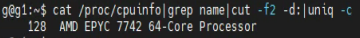

**kernel**

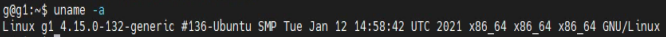

**OP**

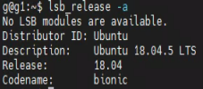

**内存大小**

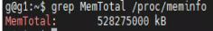

**磁盘大小**

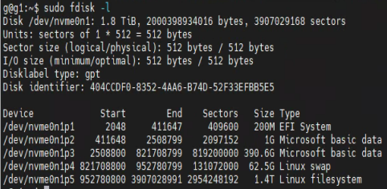

**显卡**

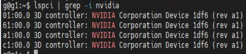

环境配置
---------

Nvidia 驱动安装(或者直接在CUDA安装中自动安装)
~~~~~~~~~~~~~~~~~~~~~~~~~~~~~~~~~~~~~~~~~~~~~~~~

| 删除旧的版本驱动
| ``$ sudo apt-get remove --purge nvidia*``
| 或 ``$ sudo apt-get purge nvidia*``
| 安装新驱动
| ``$ sudo apt update``
| ``$ sudo apt-get install ubuntu-drivers-common``
| ``$ ubuntu-drivers devices``
| ``$ sudo ubuntu-drivers autoinstall``
| ``$ sudo reboot``
| 查看是否安装成功
| ``$ nvidia-smi``

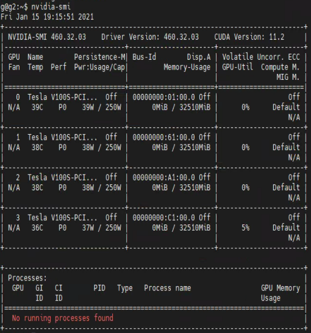

安装CUDA
~~~~~~~~~

| Verify you have a CUDA-Capable GPU
| ``$ lspci | grep -i nvidia``
|
| verify you have a supported version of linux
| ``$ uname -m && cat /etc/*release``
|
| verify the system has gcc installed
| ``$ gcc --version``
|
| verify the system has the correct kernel headers ans development packages installed
| ``$ uname -r``
| ``$ sudo apt-get install linux-headers-$(uname -r)``
|
| download the NVIDIA CUDA Toolkit
| ``$ wget https://developer.download.nvidia.com/compute/cuda/10.2/Prod/local_installers/cuda_10.2.89_440.33.01_linux.run``
| install
| ``$ sudo sh cuda_10.2.89_440.33.01_linux.run``
| accept--> no nvidia driver ---> install

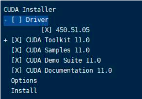

| 下载patch
| ``wget https://developer.download.nvidia.com/compute/cuda/10.2/Prod/patches/1/cuda_10.2.1_linux.run``
| ``wget https://developer.download.nvidia.com/compute/cuda/10.2/Prod/patches/2/cuda_10.2.2_linux.run``

| 安装CUDA补丁
| ``$ sudo sh cuda_10.2.1_linux.run``
| ``$ sudo sh cuda_10.2.2_linux.run``

| 安装成功

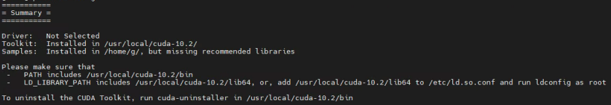

| 配置环境（两种方式）
| ~.bashrc # 修改home目录下的.bashrc文件，只针对当前用户

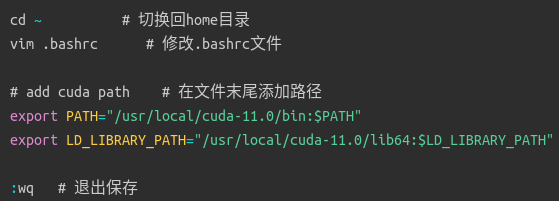

| /etc/profile   #  修改profile文件，针对所有用户

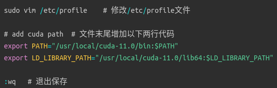

| 立即生效
| ``$ source .bashrc``
| ``$ source /etc/profile``
|
| 验证是否安装成功
| ``$ nvcc -V``

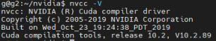

| CUDA实例编译
| ``$ cuda-install-samples-10.2.sh cuda_samples``
| ``$ cd cuda_samples/NVIDIA_CUDA-10.2_Samples``
| ``$ make -k``
| ``$ cd cuda_samples/NVIDIA_CUDA-10.2_Samples/bin/x86_64/linux/release``
| ``$ ./deviceQuery``

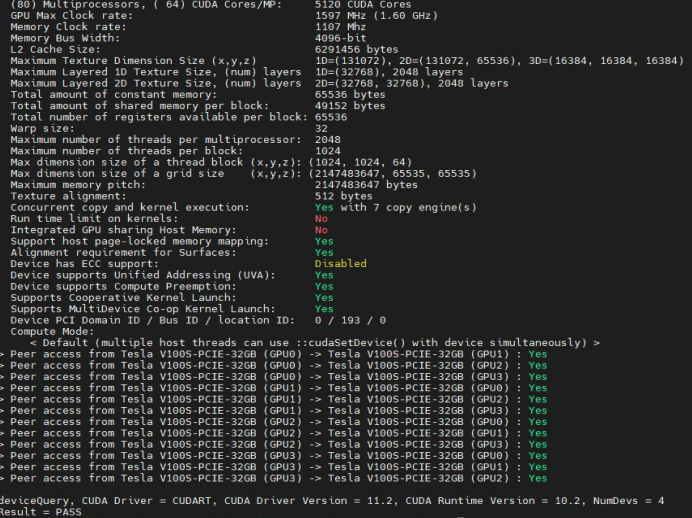

| ``$ ./bandwidthTest``

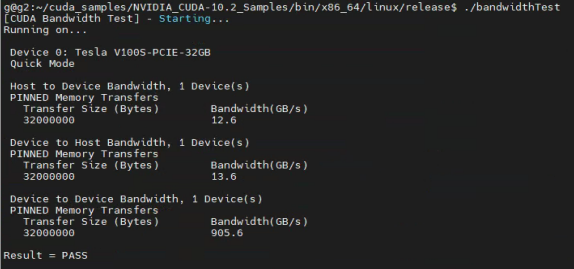

| 卸载CUDA
| ``$ sudo /usr/local/cuda-10.2/bin/cuda-uninstaller``
| ``$ sudo rm -rf /usr/local/cuda-10.2``

安装cuDNN
~~~~~~~~~~

| 下载cuDNN(需要先登陆Nvidia官网下载如下deb包)
| ``libcudnn8_8.0.4.30-1+cuda10.2_amd64.deb``
| ``libcudnn8-dev_8.0.4.30-1+cuda10.2_amd64.deb``
| ``libcudnn8-samples_8.0.4.30-1+cuda10.2_amd64.deb``
|
| 从本机windows拷贝到服务器
| ``$ scp -r C:\Users\root\Downloads\lib* g@10.75.70.222:/home/g/nvidia/``
|
| 安装
| ``$ sudo dpkg -i libcudnn8_8.0.4.30-1+cuda10.2_amd64.deb``
| ``$ sudo dpkg -i libcudnn8-dev_8.0.4.30-1+cuda10.2_amd64.deb``
| ``$ sudo dpkg -i libcudnn8-samples_8.0.4.30-1+cuda10.2_amd64.deb``
|
| 验证
| ``$ cp -r /usr/src/cudnn_samples_v8/ $HOME``
| ``$ cd  $HOME/cudnn_samples_v8/mnistCUDNN``
| ``$ make clean && make``
| (``s udo apt-get install libfreeimage3 libfreeimage-dev``)
| ``$ ./mnistCUDNN``

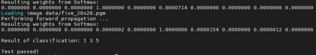

安装Anaconda
~~~~~~~~~~~~~

| ``$ wget https://repo.anaconda.com/archive/Anaconda3-2020.11-Linux-x86_64.sh``
| ``$ bash ./Anaconda3-2020.11-Linux-x86_64.sh``
| ``$ source ~/.bashrc``
| To control whether or not each shell session has the base environment activated or not
| ``$ conda config --set auto_activate_base false``
|
| 添加清华镜像源
| ``$ conda config --add channels https://mirrors.tuna.tsinghua.edu.cn/anaconda/pkgs/free/``
| ``$ conda config --add channels https://mirrors.tuna.tsinghua.edu.cn/anaconda/pkgs/main/``
| ``$ conda config --set show_channel_urls yes``
|
| 创建新环境
| ``$ conda create -n python3.8 python=3.8.1``
|
| 使用新环境
| ``conda activate python3.8``

安装相关包
~~~~~~~~~~~

| ``$ conda install Cython``
| ``$ conda install matplotlib=3.2.2``
| ``$ conda install numpy=1.18.5``
| install opencv
| `下载对应的opencv whl 包 <https://pypi.tuna.tsinghua.edu.cn/simple/opencv-python/>`_
| ``$ pip install opencv_python-4.1.2.30-cp38-cp38-manylinux1_x86_64.whl``
| ``$ conda install Pillow``
| ``$ conda install PyYAML=5.3``
| ``$ conda install scipy=1.4.1``
| ``$ conda install tensorboard=2.2``
| `根据pytorch官网安装命名安装 <https://pytorch.org/get-started/locally/>`_
| ``$ conda install pytorch torchvision torchaudio cudatoolkit=10.2 -c pytorch``
| ``$ conda install tqdm``
| logging
| ``$ pip install wandb``
| plotting
| ``$ conda install seaborn=0.11.0``
| ``$ conda install pandas``
| extras
| ``$ pip install thop``
| ``$ pip install pycocotools``

参考文档
---------

| `NVIDIA CUDNN documentation <https://docs.nvidia.com/deeplearning/cudnn/install-guide/index.html#install-linux>`_
| `CUDA Download <https://developer.nvidia.com/cuda-toolkit-archive>`_
