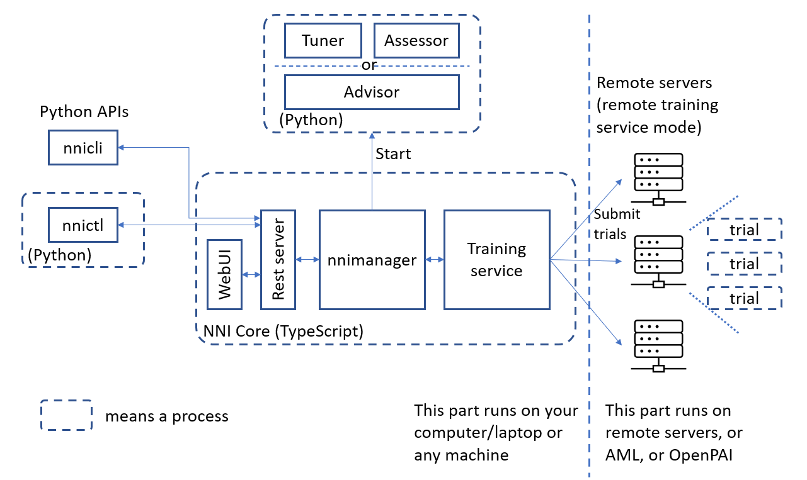

Introduction
============

NNI(Neural Network Intelligence)是一个能帮助用户自动进行特征工程，
神经网络架构搜索，超参调优及模型压缩的工具包。

官网：https://nni.readthedocs.io/zh/stable/index.html

体系结构
---------

* Experiment : 表示一次用于寻找模型最佳超参组合或神经网络架构的任务
* 搜索空间：模型的调优范围
* Configuration：来自搜索空间的实例，每个超参由特定的值
* Trial：使用某组配置的一次独立尝试
* Tuner：一个AntoML算法，会生成新的配置给下一次trial
* Assessor：分析Trail的中间结果，来确定Trial是否该提前终止
* 训练平台：Trial的执行环境，根据Experiment的配置，可以是本机，远程服务器组或其他大规模训练平台(如 OpenPAI，Kubernetes)

Experiment 过程：Tuner接收搜索空间并生成配置提交到训练平台，执行的性能结果返回给Tuner，再生成新的配置。

安装
-----

pip 安装 ``python3 -m pip install --upgrade nni``

install in docker [1]_ ``docker pull msranni/nni:latest``

*验证安装*

| ``git clone -b v1.9 https://github.com/Microsoft/nni.git``
| ``nnictl create --config nni/examples/trials/mnist-tfv1/config.yml``

如何实现NNI的Trial
-------------------

**通过NNI API**

1. 准备搜索空间参数.json文件
2. 在模型代码中加入NNI相关API
3. 定义一个.yml文件使能NNI API

**通过NNI Annotation**

另一种方式是通过NNI的python的语法来实现

内置训练平台
-------------

NNI 提供的训练平台包括本机，远程计算机，以及集群的OpenPAI，Kubeflow等。

*kubeflow*

NNI支持在Kubeflow上运行，需要一台配置好kubeconfig的Ubuntu计算机连接到此Kubernetes集群。
在Kubeflow模式下，每个Trial程序会在集群中作为一个Kubeflow作业来运行

.. image:: ./images_intro/train.png
    :align: center

参考文档
---------

.. [1] `How to Use Docker in NNI <https://nni.readthedocs.io/en/stable/Tutorial/HowToUseDocker.html>`_
