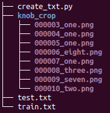
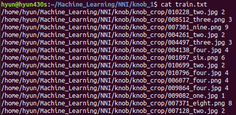
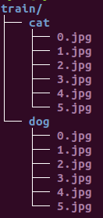

Data Loader
===========

Pytorch涉及数据集的主要是Dataset和DataLoader类。Dataset 用于描述数据集本身,
DataLoader规定了数据以何种方式送到网络中。

Dataset
--------

**Pytoch 自带数据集**

**自定义数据集**

自定义数据集是 `torch.utils.data.Dataset` 的子类，必须重写 `__getitem__` (用于索引) 和 `__len__` (获取数据集大小)方法。

以下例子说明如何创建一个自定义数据集：

1. 数据准备

图片存放在knob_crop目录下, train.txt和test.txt按7:3的比例存放对应图片的路径及label

2. 自定义数据集类MyDataset

.. code:: python

    import torch
    from torch.utils.data import Dataset
    import torchvision.transforms as transforms

    def default_loader(path):
        return Image.open(path).convert('RGB')

    class MyDataset(Dataset):
        def __init__(self, txt, transform=None, target_transform=None, loader=default_loader):
            super(MyDataset,self).__init__()
            fh = open(txt, 'r')
            imgs = []
            for line in fh:
                line = line.strip('\n')
                line = line.rstrip('\n')
                words = line.split()
                imgs.append((words[0], int(words[1])))
            self.imgs = imgs
            self.transform = transform
            self.target_transform = target_transform
            self.loader = loader

        def __getitem__(self, index):
            fn, label = self.imgs[index]
            img = self.loader(fn)
            if self.transform is not None:
                img = self.transform(img)
            return img, label

        def __len__(self):
            return len(self.imgs)

    transforms_train = transforms.Compose([
        transforms.Resize((32,32)),
        transforms.ToTensor()
    ])

    transforms_test = transforms.Compose([
        transforms.Resize((32,32)),
        transforms.ToTensor()
    ])

    trainset = MyDataset(txt='./train.txt', transform=transforms_train)
    testset = MyDataset(txt='./test.txt', transform=transforms_test)

**ImageFolder**

对于简单的分类数据集，pytorch提供了更简便的方式ImageFolder

ImageFolder要求数据集按如下方式存放数据：

.. code:: python

    import torch
    from torch.utils.data import DataLoader
    from torchvision import transforms, datasets
    import matplotlib.pyplot as plt
    import numpy as np

    data_transform = transforms.Compose([
        transforms.Resize(224,224),
        transforms.ToTensor(),
    ])

    train_dataset = datasets.ImageFolder(root='./train', transform=data_transform)
    train_dataloader = DataLoader(dataset=train_dataset,
                                    batch_size=4,
                                    shuffle=True,
                                    num_workers=4)

    def show_batch_images(sample_batch):
        labels_batch = sample_batch[1]
        images_batch = sample_batch[0]

        for i in range(4):
            label_ = labels_batch[i].item()
            image_ = np.transpose(images_batch[i], (1,2,0))
            ax = plt.subplot(1,4,i+1)
            ax.imshow(image_)
            ax.set_title(str(label_))
            ax.axis('off')
            plt.pause(0.01)

    plt.figure()
    for i_batch, sample_batch in enumerate(train_dataloader):
        show_batch_images(sample_batch)
        plt.show()

DataLoader
-----------

使用Dataloader有如下优点：

1. 数据以mini_batch的形式输入网络
#. 样本加载的时候可随机打乱顺序
#. 样本加载需要多线程

